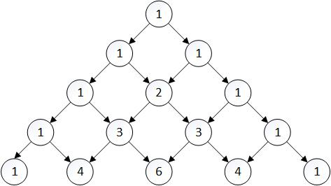
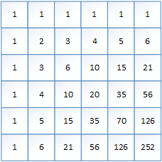
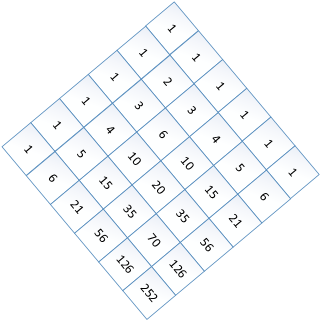
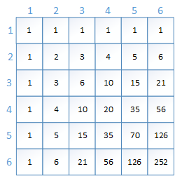

# 组合计数


## 二项式系数


二项式系数又可以称为组合数


$$
C_0^0 = 1
$$

$$
C_1^0 = 1 , C_1^1 = 1
$$

$$
C_2^0 = 1,C_2^1 = 2,C_2^2 = 1
$$

从上图可以看出组合数递推式：
$$
C_n^k = C_{n-1}^{k-1} + C_{n-1}^{k}
$$
通常情况下，我们直接使用递推计算组合数：

```c++
typedef long long LL;
vector<vector<LL>> C;
LL combnum(LL n,LL k,LL MOD) //C(n,k) mod MOD, and MOD must be a primer
{
    C = vector<vector<LL>>(n+1,vector<LL>());
    C[0].push_back(1);
	for(int i=1;i<=n;i++){
        for(int j=0;j<=i;j++){
            if(j > 0) C[i].push_back(C[i-1][j-1] + C[i-1][j]);
            else C[i].push_back(C[i-1][j]);
        }
    }
    return C[n][k];
}
```

但是如果n的取值非常大，可以选择直接计算，通常题目中会要求模上一个素数，这个时候需要注意除法需要求逆，求逆时使用快速幂。

```c++
typedef long long LL;
LL quickpow(LL a,LL b,LL c) // a^b mod c
{
    a %= c;
    LL ret = 1;
    while(b){
        if(b % 2){
            ret = (ret * a) % c;
        }
        a = (a*a) % c;
        b /= 2;
    }
    return ret;
}

LL combnum(LL n,LL k,LL MOD) //C(n,k) mod MOD, and MOD must be a primer
{
    LL ret = 1;
    for(int i=0;i<k;i++){
        ret = (ret * (n - i)) % MOD;
    }
    for(int i=1;i<=k;i++){
        ret = (ret * (quickpow(i,MOD-2,MOD))) % MOD;
    }
    return ret;
}
```


例题


分析

首先这道题的递推式很容易发现：$sum(k,n) = sum(k-1,n) + sum(k,n-1)$，但是由于k的取值范围太大，因此不可能直接使用递推进行 计算，因此我们考虑是否可以直接计算，即求出$\beta_{i,j}$使得以下公式可以直接计算：

$$
sum(k,n) = \beta_{k,1} \cdot a_n + \beta_{k,2} \cdot a_{n-1} + \cdots + \beta_{k,n} \cdot a_1
$$

对于n=4,k=4，手动计算如下：
$$
sum(1,4) = 1 \cdot a_4 + 1 \cdot a_{3} + 1 \cdot a_2 + 1 \cdot a_1
$$

$$
sum(2,4) = 1 \cdot a_4 + 2 \cdot a_{3} + 3 \cdot a_2 + 4 \cdot a_1
$$

$$
sum(3,4) = 1 \cdot a_4 + 3 \cdot a_{3} + 6 \cdot a_2 + 10 \cdot a_1
$$

$$
sum(4,4) = 1 \cdot a_4 + 4 \cdot a_{3} + 10 \cdot a_2 + 20 \cdot a_1
$$

我们可以猜测到$\beta_{i,j}$的递推式为：$$\beta_{i,j} = \beta_{i-1,j} + \beta_{i,j-1}$$，这个与sum(k,n)实际上是一样的，只不过**首项全部为1**。

当然同样的我们不可以直接使用递推式进行计算，因此 我们重新观察一下$\beta_{i,j}$:



旋转一下，我们可以跟二项式系数比较一下：



为了导出$\beta_{i,j}$的计算公式，加上下标：



$$\beta_{3,3}$$我们可以看到它对应的组合数是是$C_4^2$，这个推导是很容易的：**行号加列号减一表示当前元素在第几个对角线上，列号表示当前元素在对角线上的位置**。由于组合数是从0开始的，因此我们可以推出：
$$
\beta{i,j} = C_{i+j-2}^{j-1}
$$
以上所有内容可以用来解决这道题目，代码如下：

```c++
#include <iostream>
#include <cstdlib>

using namespace std;

typedef long long LL;
const LL PRIMER = 998244353;
LL quickpow(LL a,LL b,LL c) // a^b mod c
{
    a %= c;
    LL ret = 1;
    while(b){
        if(b % 2){
            ret = (ret * a) % c;
        }
        a = (a*a) % c;
        b /= 2;
    }
    return ret;
}

LL combnum(LL n,LL k,LL MOD) //C(n,k) mod MOD, and MOD must be a primer
{
    LL ret = 1;
    for(int i=0;i<k;i++){
        ret = (ret * (n - i)) % MOD;
    }
    for(int i=1;i<=k;i++){
        ret = (ret * (quickpow(i,MOD-2,MOD))) % MOD;
    }
    return ret;
}

int main(int argc,char **argv){

    int n,k;
    int ans = 0;
    cin >> n >> k;
    for(int i=0;i<n;i++){
        int a;
        cin >> a;
        ans = (ans + (a * combnum(k+n - i - 2,n-i-1,PRIMER)) % PRIMER) % PRIMER;

    }
    cout << ans << endl;
    return 0;
}
             
```


